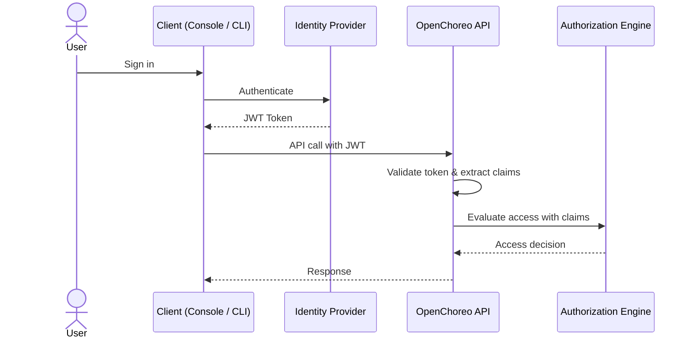

# Your IDP Should Talk to Your IdP: Pluggable Identity in OpenChoreo

Back in 2022, Gartner predicted:

> "By 2026, 80% of large software engineering organizations will establish platform engineering teams as internal providers of reusable services, components and tools for application delivery — up from 45% in 2022." — Gartner

That shift has happened. IDPs are no longer an experiment. They are now the standard way engineering organizations deliver software at scale. And as IDPs mature, the question of identity becomes impossible to ignore.

Every IDP needs to know who is using it, what they are allowed to do, and whether that answer changes when someone joins, moves teams, or leaves. That is an identity problem. And most organizations already have an identity system built for exactly this. An IdP (Identity Provider) that engineers use every day to access Slack, GitHub, the cloud console, and everything else.

The problem starts when the IDP (Internal Developer Platform) manages its own identity, disconnected from the IdP your organization already relies on. Now you have two systems that know nothing about each other. Someone changes teams or leaves the company and the IDP is the last to know.

This is what happens when an IDP does not talk to your IdP.

---

## OpenChoreo: An IDP Built to Talk to Your IdP

[OpenChoreo](https://openchoreo.dev/) is a [CNCF project](https://www.cncf.io/projects/openchoreo/) focused on bringing Internal Developer Platform abstractions on top of Kubernetes. It gives teams higher-level constructs like projects, components, environments, and deployment pipelines so developers can focus on building software rather than wiring up infrastructure. Platform engineers configure it once and developers get a self-service experience on top.

Being part of the CNCF ecosystem means OpenChoreo is built on open standards and integrates naturally with the broader cloud native tooling your teams already use. One of its core design goals is to fit into your organization's existing ecosystem rather than ask you to replace things that already work well. That includes identity, which is where most platforms quietly create problems for themselves.

---

## Two Kinds of Identity in a Developer Platform

Before getting into how OpenChoreo makes the IDP and IdP talk to each other, it helps to understand what identity actually means in this context. It covers two separate things that are easy to mix up.

Think of a hotel. Staff enter through a side entrance with a security checkpoint. They show their employee badge, get verified, and are granted access based on their role. A housekeeper gets into guest floors. A chef gets into the kitchen. A manager gets access to everything.

Guests use the main entrance. They check in at the front desk and access the services the hotel provides. Their experience is completely separate from how the staff is managed.

The same separation applies in a developer platform.

The first is platform identity. This covers everyone and everything that interacts with OpenChoreo itself: developers, CI/CD pipelines, platform admins, and the policies that govern what each of them can do.

The second is application user identity. This is about who interacts with the services that teams deploy on OpenChoreo. The end users, customers, or partner systems calling the APIs your teams have built. That belongs to the application's own auth design and is independent from how the platform itself is secured.

OpenChoreo treats these as completely independent concerns. You can use the same identity provider for both or point them at different ones depending on what your organization needs. This series is focused entirely on platform identity.

---

## How OpenChoreo Handles Identity and Access

Instead of maintaining its own user store, OpenChoreo connects directly to your IdP using the widely adopted OAuth2 and OpenID Connect (OIDC) standard protocols. This means any OIDC-compliant identity provider, whether that is Okta, Microsoft Entra ID, Auth0, AWS Cognito, or any other, can be plugged in without custom integrations. When someone signs in, your IdP issues a JWT carrying live identity information about that person. OpenChoreo validates it and extracts the claims inside. Those claims then go to OpenChoreo's authorization engine, which matches them against the roles and permissions configured in the platform.

OpenChoreo supports different principal types. A developer signing into the console is a human user identified by a `groups` or `roles` claim. A GitHub Actions workflow is a service account identified by its `sub` claim. You define these types and tell the platform which claim to read for each one.

Access decisions reflect your organization's current state at all times. Someone changes teams, their access changes. Someone leaves, their access is gone. There is no separate system to keep in sync, because there is no separate system.

---

## Getting Started: Thunder as the Default Identity Provider

OpenChoreo ships with [Thunder](https://github.com/asgardeo/thunder) as its default identity provider. It is a lightweight, open-source OIDC server that runs as part of the control plane with no external setup needed.

If you want to get a feel for OpenChoreo, the [quick start guide](https://openchoreo.dev/docs/getting-started/quick-start-guide/) gets you a running instance locally in around 10 minutes.

---

## What's Next

This post covered the foundation: what platform identity means in OpenChoreo, how it differs from application user identity, and how identification and access control work together. I am planning to do a series of more practical posts, each walking through connecting a specific enterprise identity provider to OpenChoreo end to end.
